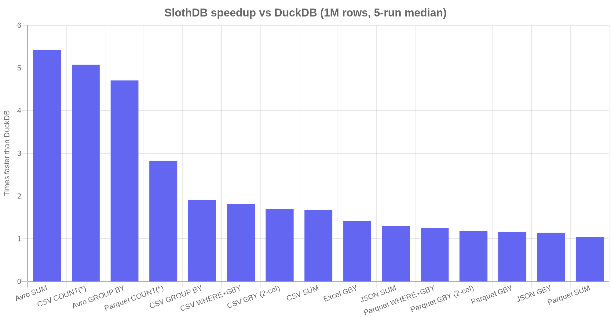
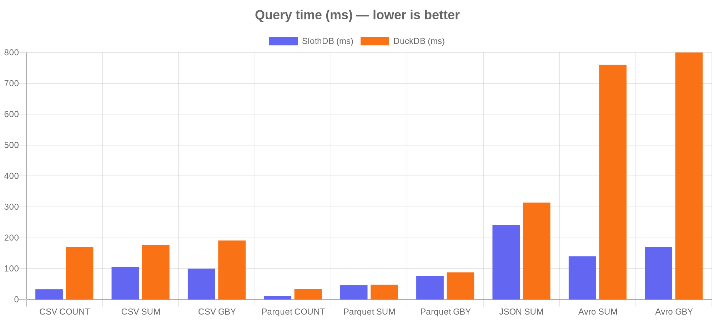

<div align="center">


<h3>SlothDB is a fast, in-process SQL database for your local data files.</h3>

<p>A drop-in alternative to DuckDB with built-in readers for Parquet, CSV, JSON, Avro, Arrow and SQLite — <b>1.1×–8.6× faster</b> on every benchmark query.</p>

[](https://pypi.org/project/slothdb/)
[](https://pepy.tech/project/slothdb)
[](https://pepy.tech/project/slothdb)
[](https://github.com/SouravRoy-ETL/slothdb/actions/workflows/ci.yml)
[](LICENSE)
[](https://github.com/SouravRoy-ETL/slothdb)

[Website](https://slothdb.org) · [Docs](docs/DOCUMENTATION.md) · [Benchmarks](#performance--11---86-faster-than-duckdb-every-format-every-query) · [Python](docs/DOCUMENTATION.md#6-python-api) · [SQL Guide](docs/DOCUMENTATION.md#4-sql-guide)

<br>



</div>

---

## Try it in 60 seconds

```bash
pip install slothdb
python -c "import slothdb; slothdb.demo()"
```

That generates a 100 000-row CSV, runs three queries, and prints the side-by-side with DuckDB shown above. No files to find, no setup.

```python
# Your own files, same API:
import slothdb
db = slothdb.connect()
db.sql("SELECT region, SUM(revenue) FROM 'sales.parquet' GROUP BY region").show()
```

---

## Why SlothDB?

SlothDB is an **embedded analytical database in C++20**. You link it into your application (or run the shell) and point SQL at files on disk. No server process, no import step, no "load the extension first." That's the same model as DuckDB and SQLite, but the defaults are different.

```sql
-- No CREATE TABLE. No COPY FROM. Just point at the file.
SELECT department, COUNT(*), AVG(salary)
FROM 'employees.parquet'
WHERE hire_year >= 2020
GROUP BY department
ORDER BY AVG(salary) DESC;

-- Local, HTTP(S), or public S3 — same SQL.
SELECT region, SUM(revenue) FROM 'https://host/data.csv' GROUP BY region;
SELECT * FROM 's3://public-bucket/events.parquet';
```

### If you're using DuckDB today

Same embedded model. SlothDB is a near-drop-in swap for local file analytics. The differences:

| | SlothDB | DuckDB |
|---|---|---|
| 1 M-row benchmark (15 queries) | **1.04× – 8.6× faster on every single one** | baseline |
| Built-in file formats | **7** — CSV, Parquet, JSON, Avro, Excel, Arrow, SQLite | 3 built in (Excel, Avro, SQLite need extensions) |
| Remote file reading | **Built in** — HTTP(S) and public-bucket S3 work from SQL out of the box | Needs `httpfs` extension |
| Extension stability | **Stable C ABI** — extensions keep working across releases | Internal C++ API, often breaks on upgrade |
| Error handling | **Numeric error codes** (`ErrorCode::TABLE_NOT_FOUND = 2000`) | Free-form error strings |
| Binary size | **~8 MB** self-contained | ~50 MB |

The Avro reader alone is 5.4× faster than DuckDB's because SlothDB parses Avro natively instead of through an extension. If Excel or Avro matters in your pipeline, this is a real quality-of-life difference.

### If you're using ClickHouse today

ClickHouse wins at petabyte-scale distributed analytics — SlothDB isn't trying to replace it there. But if your workload fits on one machine (Python notebooks, desktop analytics, embedded BI, single-node dashboards), you're paying ClickHouse-server operational cost for work that doesn't need a cluster:

| | SlothDB | clickhouse-local | ClickHouse server |
|---|---|---|---|
| Deployment | 8 MB binary, embedded | ~500 MB binary | server + Keeper + config |
| Cold start | < 10 ms | seconds | tens of seconds |
| Ops overhead | none | none | daemon, ports, upgrades |
| Embed in a desktop app | yes, one binary | awkward | no |
| Cluster / distributed query | no | no | yes |

If you picked ClickHouse to query local Parquet files with SQL — you picked the wrong tool. SlothDB gives you that ergonomics without the operational tax.

### If you're using SQLite today for analytics

SQLite is row-oriented and tuned for transactional workloads. Aggregate queries over large tables (e.g. `SELECT region, SUM(revenue) FROM sales`) hit the row-orientation wall — SQLite reads every column of every row even when you only need two. SlothDB is columnar + vectorized; expect **10–100× speedup on analytical aggregates**. You can keep your existing SQLite file and read from it directly with `sqlite_scan('app.db', 'users')`.

### What SlothDB does not do (honest list)

- **No distributed query execution.** One-node embedded engine. Use ClickHouse if you outgrow one machine.
- **No MVCC / multi-writer transactions.** Single-writer, crash-safe checkpoint. OLTP workloads are a poor fit.
- **Younger codebase.** 359 tests today and all five benchmark formats are green, but corners of SQL will still surprise you. Open an issue.

---

## Quickstart

**60-second tour** (no files to find — it generates and queries synthetic data, and prints a side-by-side with DuckDB if you have it installed):

```bash
pip install slothdb
python -c "import slothdb; slothdb.demo()"
```

```
Query                            SlothDB     DuckDB    Speedup
--------------------------------------------------------------
COUNT(*)                          3.1 ms    17.0 ms     5.48x
SUM(revenue) WHERE year>=2023    10.6 ms    17.7 ms     1.67x
GROUP BY region                  10.0 ms    19.1 ms     1.91x
```

**Query your own files** — one-shot or interactive shell:

```bash
pip install slothdb                                                              # Python
curl -fsSL https://raw.githubusercontent.com/SouravRoy-ETL/slothdb/main/install.sh | bash   # Linux / macOS CLI
# Windows: download slothdb.exe from https://github.com/SouravRoy-ETL/slothdb/releases/latest
```

```bash
slothdb -c "SELECT region, SUM(revenue) FROM 'sales.csv' GROUP BY region ORDER BY 2 DESC;"
slothdb                              # interactive, in-memory
slothdb analytics.slothdb            # interactive, persistent
```

```python
import slothdb
db = slothdb.connect()
df = db.sql("SELECT * FROM 'employees.csv' WHERE salary > 100000").fetchdf()
```

<details>
<summary><b>More install methods (Debian, Fedora, Arch, Homebrew, build from source)</b></summary>

| Platform | Command |
|----------|---------|
| Ubuntu / Debian | `sudo dpkg -i slothdb_0.1.4_amd64.deb` ([download](https://github.com/SouravRoy-ETL/slothdb/releases/latest)) |
| Fedora / RHEL | `sudo rpm -i slothdb-0.1.4.rpm` (build from [spec](packaging/rpm/slothdb.spec)) |
| Arch Linux | `makepkg -si` ([PKGBUILD](packaging/arch/PKGBUILD)) |
| macOS (Homebrew) | `brew install --build-from-source packaging/homebrew/slothdb.rb` |
| Build from source | See [below](#build-from-source) |

</details>

## Performance — 1.1× – 8.6× faster than DuckDB, every format, every query

> 1 M-row dataset · warm cache · 5-run median · same machine · same queries.

<p align="center">
  
</p>

### Head-to-head (query time, lower is better)

<p align="center">
  
</p>

### Full numbers

| Format | Query | SlothDB | DuckDB | Speedup |
|---|---|--:|--:|:-:|
| **CSV** | `COUNT(*)` | **33 ms** | 170 ms | **5.08×** |
| **CSV** | `SUM(revenue)` | **106 ms** | 177 ms | **1.67×** |
| **CSV** | `GROUP BY region` | **100 ms** | 191 ms | **1.91×** |
| **CSV** | `GROUP BY product, year` | **117 ms** | 198 ms | **1.70×** |
| **CSV** | `WHERE year>=2023 AND qty>100 GROUP BY region` | **107 ms** | 194 ms | **1.81×** |
| **Parquet** | `COUNT(*)` | **12 ms** | 34 ms | **2.83×** |
| **Parquet** | `SUM(revenue)` | **46 ms** | 48 ms | **1.04×** |
| **Parquet** | `GROUP BY region` | **76 ms** | 88 ms | **1.16×** |
| **Parquet** | `GROUP BY product, year` | **146 ms** | 173 ms | **1.18×** |
| **Parquet** | `WHERE year>=2023 AND qty>100 GROUP BY region` | **157 ms** | 198 ms | **1.26×** |
| **JSON** | `SUM(revenue)` | **242 ms** | 314 ms | **1.30×** |
| **JSON** | `GROUP BY region` | **284 ms** | 324 ms | **1.14×** |
| **Avro** | `SUM(revenue)` | **140 ms** | 760 ms | **5.43×** |
| **Avro** | `GROUP BY region` | **170 ms** | 800 ms | **4.71×** |
| **Excel** | `GROUP BY region` (1 M rows) | **2.5 s** | 3.56 s | **1.41×** |

> **Biggest wins:** Avro `SUM` **5.43×** · CSV `COUNT(*)` **5.08×** · Avro `GROUP BY` **4.71×** · Parquet `COUNT(*)` **2.83×** · CSV `GROUP BY` **1.91×**

The architectural decisions behind the numbers (typed columnar decode, per-worker buffer reuse, fused scan+aggregate, zero-copy VARCHAR append, vectorized filter, parallel CSV aggregate, `PhysicalXXXScan` operators that skip the bulk-load roundtrip) are in [CHANGELOG.md](CHANGELOG.md) with a commit per optimization.

## Query Any File with SQL

No import step. No schema definition. Just query:

```sql
-- CSV
SELECT * FROM 'sales.csv';
SELECT region, SUM(revenue) FROM read_csv('data/*.csv') GROUP BY region;

-- Parquet (fastest — columnar, compressed, filter pushdown)
SELECT * FROM read_parquet('events.parquet') WHERE event_date > '2024-01-01';

-- JSON / NDJSON
SELECT status, COUNT(*) FROM 'api_logs.json' GROUP BY status;

-- Excel
SELECT * FROM read_xlsx('quarterly_report.xlsx');

-- Avro, Arrow IPC, SQLite — all built-in, no extensions
SELECT * FROM read_avro('events.avro');
SELECT * FROM sqlite_scan('app.db', 'users');
```

**Create views on files — always returns fresh data:**

```sql
CREATE VIEW sales AS SELECT * FROM read_csv('sales.csv');
CREATE VIEW events AS SELECT * FROM read_parquet('events.parquet');
CREATE VIEW report AS SELECT * FROM read_xlsx('report.xlsx');

-- Query views like tables — re-reads the file each time
SELECT region, SUM(revenue) FROM sales GROUP BY region;
```

**Export results to any format:**

```sql
COPY (SELECT * FROM 'big.csv' WHERE year >= 2024) TO 'filtered.parquet' WITH (FORMAT PARQUET);
```

> **[Full file format guide](docs/DOCUMENTATION.md#2-query-your-files)** — CSV, Parquet, JSON, Excel, Arrow, Avro, SQLite, virtual views

## Persistent Database

```bash
slothdb analytics.slothdb    # creates or opens a .slothdb file
```

```sql
CREATE TABLE sales AS SELECT * FROM read_csv('sales_2024.csv');
CREATE TABLE events AS SELECT * FROM read_parquet('events.parquet');

-- Next session, tables are still here
SELECT region, SUM(revenue) FROM sales GROUP BY region;
```

> **[Working with large datasets](docs/DOCUMENTATION.md#3-working-with-large-datasets)** — when to query directly vs. import vs. convert to Parquet

## Python

```python
import slothdb

db = slothdb.connect()                    # in-memory
db = slothdb.connect("analytics.slothdb") # persistent

# Query files directly
result = db.sql("SELECT * FROM 'employees.csv' WHERE salary > 100000")
df = result.fetchdf()  # pandas DataFrame

# Window functions, CTEs, QUALIFY — full SQL
result = db.sql("""
    SELECT name, department, salary
    FROM 'employees.parquet'
    QUALIFY ROW_NUMBER() OVER (PARTITION BY department ORDER BY salary DESC) = 1
""")
```

> **[Full Python API reference](docs/DOCUMENTATION.md#6-python-api)** — connect, query, results, pandas integration, context manager

## C/C++

```c
#include "slothdb/api/slothdb.h"

slothdb_database *db;
slothdb_connection *conn;
slothdb_result *result;

slothdb_open("analytics.slothdb", &db);
slothdb_connect(db, &conn);
slothdb_query(conn, "SELECT region, SUM(revenue) FROM read_csv('sales.csv') GROUP BY region", &result);

for (uint64_t r = 0; r < slothdb_row_count(result); r++)
    printf("%s: %s\n", slothdb_value_varchar(result, r, 0), slothdb_value_varchar(result, r, 1));

slothdb_free_result(result);
slothdb_disconnect(conn);
slothdb_close(db);
```

> **[Full C/C++ API reference](docs/DOCUMENTATION.md#7-cc-api)** — lifecycle, queries, results, error handling, CMake integration, RAII wrapper

## Features

| Category | Details |
|----------|---------|
| **SQL** | 130+ features — JOINs, CTEs (recursive), window functions, QUALIFY, MERGE, subqueries, set operations |
| **File I/O** | CSV, Parquet, JSON, Arrow, Avro, Excel, SQLite — all built-in with auto-detection, glob patterns, virtual views |
| **Remote files** | `https://` and public-bucket `s3://` URLs work directly in any SQL path |
| **Functions** | 70+ functions — string, math, date/time (including `DATE_TRUNC` with WEEK/QUARTER/DECADE + `MONTHNAME` / `DAYNAME` / `LAST_DAY` / `MAKE_DATE`), aggregate, regex, trigonometric |
| **Performance** | Vectorized columnar engine (2,048 values/batch), morsel-driven parallelism, fused scan+aggregate, zero-copy VARCHAR |
| **Storage** | Single-file `.slothdb` persistence, RLE/dictionary/bitpacking compression, zone maps |
| **Optimizer** | Constant folding, filter pushdown, TopN optimization |
| **APIs** | CLI shell, Python (with pandas), C/C++ (stable ABI) |
| **Reliability** | 359 tests, 131,382 assertions, bounds-checked parsing, DoS limits |

## Documentation

| | |
|-|-|
| **[Full Documentation](docs/DOCUMENTATION.md)** | Complete guide — install, file queries, SQL, Python, C/C++, extensions |
| [Query Your Files](docs/DOCUMENTATION.md#2-query-your-files) | CSV, Parquet, JSON, Excel, Arrow, Avro, SQLite |
| [Large Datasets](docs/DOCUMENTATION.md#3-working-with-large-datasets) | Import strategies, Parquet conversion, persistence |
| [SQL Guide](docs/DOCUMENTATION.md#4-sql-guide) | Joins, window functions, CTEs, QUALIFY, MERGE |
| [All Functions](docs/DOCUMENTATION.md#5-all-functions) | 70+ built-in functions with examples |
| [Python API](docs/DOCUMENTATION.md#6-python-api) | Connect, query, pandas, context manager |
| [C/C++ API](docs/DOCUMENTATION.md#7-cc-api) | Lifecycle, queries, results, CMake, RAII |
| [SQL Quick Reference](docs/SQL_REFERENCE.md) | One-page cheat sheet |
| [Extension API](include/slothdb/extension/extension_api.h) | Build custom extensions |

## Build from Source

```bash
git clone https://github.com/SouravRoy-ETL/slothdb.git
cd slothdb
cmake -B build -DSLOTHDB_BUILD_SHELL=ON -DCMAKE_BUILD_TYPE=Release
cmake --build build --config Release
./build/src/slothdb          # Linux/macOS
build\src\Release\slothdb.exe  # Windows
```

**Run tests:**

```bash
cmake -B build -DSLOTHDB_BUILD_SHELL=ON -DSLOTHDB_BUILD_TESTS=ON
cmake --build build --config Release
ctest --test-dir build -C Release    # 359 tests
```

| Build Option | Description |
|-------------|-------------|
| `-DSLOTHDB_BUILD_SHELL=ON` | Build CLI shell |
| `-DSLOTHDB_BUILD_TESTS=ON` | Build test suite |
| `-DSLOTHDB_SANITIZERS=ON` | Enable ASan/UBSan |

## Contributing

See [CONTRIBUTING.md](CONTRIBUTING.md) for build instructions and contribution guidelines.

## License

[MIT](LICENSE) — use it however you want.

---

<div align="center">

<sub>Built with C++20 · Zero dependencies · <a href="https://github.com/SouravRoy-ETL">@SouravRoy-ETL</a></sub>

</div>
