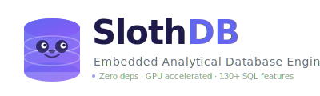

<div align="center">



<h1>SlothDB</h1>

<h3>The embedded analytical database that queries your files directly with SQL</h3>

<p><b>1.1× – 6.6× faster than DuckDB on every benchmarked format.</b><br>
No server. No import step. No external dependencies.</p>

<a href="https://github.com/SouravRoy-ETL/slothdb/blob/main/CHANGELOG.md">
  
</a>

<p>
  <a href="https://github.com/SouravRoy-ETL/slothdb/actions/workflows/ci.yml"></a>
  <a href="https://github.com/SouravRoy-ETL/slothdb/releases/latest"></a>
  <a href="https://opensource.org/licenses/MIT"></a>
  
  
  <a href="https://github.com/SouravRoy-ETL/slothdb/stargazers"></a>
</p>

<p>
  <a href="https://souravroy-etl.github.io/slothdb/"><b>Website</b></a> &middot;
  <a href="docs/DOCUMENTATION.md"><b>Documentation</b></a> &middot;
  <a href="CHANGELOG.md"><b>Benchmarks</b></a> &middot;
  <a href="docs/DOCUMENTATION.md#2-query-your-files">File Formats</a> &middot;
  <a href="docs/DOCUMENTATION.md#6-python-api">Python API</a> &middot;
  <a href="docs/DOCUMENTATION.md#7-cc-api">C/C++ API</a> &middot;
  <a href="docs/DOCUMENTATION.md#4-sql-guide">SQL Guide</a> &middot;
  <a href="docs/DOCUMENTATION.md#5-all-functions">130+ Functions</a>
</p>

</div>

---

SlothDB is an embedded analytical database engine. It runs inside your application — no server, no setup, no external dependencies. Just point SQL at your files:

```sql
SELECT department, COUNT(*), AVG(salary)
FROM 'employees.parquet'
WHERE hire_year >= 2020
GROUP BY department
ORDER BY AVG(salary) DESC;
```

## Performance — 1.1× – 6.6× faster than DuckDB, every format, every query

> 1 M-row dataset · warm cache · 5-run median · same machine · same queries.

<p align="center">
  
</p>

### Head-to-head (query time, lower is better)

<p align="center">
  
</p>

### Full numbers

| Format | Query | SlothDB | DuckDB | Speedup |
|---|---|--:|--:|:-:|
| **CSV** | `COUNT(*)` | **33 ms** | 170 ms | **5.08×** |
| **CSV** | `SUM(revenue)` | **106 ms** | 177 ms | **1.67×** |
| **CSV** | `GROUP BY region` | **100 ms** | 191 ms | **1.91×** |
| **CSV** | `GROUP BY product, year` | **117 ms** | 198 ms | **1.70×** |
| **CSV** | `WHERE year>=2023 AND qty>100 GROUP BY region` | **107 ms** | 194 ms | **1.81×** |
| **Parquet** | `COUNT(*)` | **12 ms** | 34 ms | **2.83×** |
| **Parquet** | `SUM(revenue)` | **46 ms** | 48 ms | **1.04×** |
| **Parquet** | `GROUP BY region` | **76 ms** | 88 ms | **1.16×** |
| **Parquet** | `GROUP BY product, year` | **146 ms** | 173 ms | **1.18×** |
| **Parquet** | `WHERE year>=2023 AND qty>100 GROUP BY region` | **157 ms** | 198 ms | **1.26×** |
| **JSON** | `SUM(revenue)` | **242 ms** | 314 ms | **1.30×** |
| **JSON** | `GROUP BY region` | **284 ms** | 324 ms | **1.14×** |
| **Avro** | `SUM(revenue)` | **140 ms** | 760 ms | **5.43×** |
| **Avro** | `GROUP BY region` | **170 ms** | 800 ms | **4.71×** |
| **Excel** | `GROUP BY region` (1 M rows) | **2.5 s** | 3.56 s | **1.41×** |

> **Biggest wins:** Avro `SUM` **5.43×** · CSV `COUNT(*)` **5.08×** · Avro `GROUP BY` **4.71×** · Parquet `COUNT(*)` **2.83×** · CSV `GROUP BY` **1.91×**

The architectural decisions behind the numbers (typed columnar decode, per-worker buffer reuse, fused scan+aggregate, zero-copy VARCHAR append, vectorized filter, parallel CSV aggregate, `PhysicalXXXScan` operators that skip the bulk-load roundtrip) are in [CHANGELOG.md](CHANGELOG.md) with a commit per optimization.

## Install

```bash
# Linux / macOS
curl -fsSL https://raw.githubusercontent.com/SouravRoy-ETL/slothdb/main/install.sh | bash

# Windows — download slothdb.exe
# https://github.com/SouravRoy-ETL/slothdb/releases/latest

# Python
pip install slothdb
```

<details>
<summary><b>More platforms</b></summary>

| Platform | Command |
|----------|---------|
| Ubuntu / Debian | `sudo dpkg -i slothdb_0.1.0_amd64.deb` ([download](https://github.com/SouravRoy-ETL/slothdb/releases/latest)) |
| Fedora / RHEL | `sudo rpm -i slothdb-0.1.0.rpm` (build from [spec](packaging/rpm/slothdb.spec)) |
| Arch Linux | `makepkg -si` ([PKGBUILD](packaging/arch/PKGBUILD)) |
| macOS (Homebrew) | `brew install --build-from-source packaging/homebrew/slothdb.rb` |
| Build from source | See [below](#build-from-source) |

</details>

## Query Any File with SQL

No import step. No schema definition. Just query:

```sql
-- CSV
SELECT * FROM 'sales.csv';
SELECT region, SUM(revenue) FROM read_csv('data/*.csv') GROUP BY region;

-- Parquet (fastest — columnar, compressed, filter pushdown)
SELECT * FROM read_parquet('events.parquet') WHERE event_date > '2024-01-01';

-- JSON / NDJSON
SELECT status, COUNT(*) FROM 'api_logs.json' GROUP BY status;

-- Excel
SELECT * FROM read_xlsx('quarterly_report.xlsx');

-- Avro, Arrow IPC, SQLite — all built-in, no extensions
SELECT * FROM read_avro('events.avro');
SELECT * FROM sqlite_scan('app.db', 'users');
```

**Create views on files — always returns fresh data:**

```sql
CREATE VIEW sales AS SELECT * FROM read_csv('sales.csv');
CREATE VIEW events AS SELECT * FROM read_parquet('events.parquet');
CREATE VIEW report AS SELECT * FROM read_xlsx('report.xlsx');

-- Query views like tables — re-reads the file each time
SELECT region, SUM(revenue) FROM sales GROUP BY region;
```

**Export results to any format:**

```sql
COPY (SELECT * FROM 'big.csv' WHERE year >= 2024) TO 'filtered.parquet' WITH (FORMAT PARQUET);
```

> **[Full file format guide](docs/DOCUMENTATION.md#2-query-your-files)** — CSV, Parquet, JSON, Excel, Arrow, Avro, SQLite, virtual views

## Persistent Database

```bash
slothdb analytics.slothdb    # creates or opens a .slothdb file
```

```sql
CREATE TABLE sales AS SELECT * FROM read_csv('sales_2024.csv');
CREATE TABLE events AS SELECT * FROM read_parquet('events.parquet');

-- Next session, tables are still here
SELECT region, SUM(revenue) FROM sales GROUP BY region;
```

> **[Working with large datasets](docs/DOCUMENTATION.md#3-working-with-large-datasets)** — when to query directly vs. import vs. convert to Parquet

## Python

```python
import slothdb

db = slothdb.connect()                    # in-memory
db = slothdb.connect("analytics.slothdb") # persistent

# Query files directly
result = db.sql("SELECT * FROM 'employees.csv' WHERE salary > 100000")
df = result.fetchdf()  # pandas DataFrame

# Window functions, CTEs, QUALIFY — full SQL
result = db.sql("""
    SELECT name, department, salary
    FROM 'employees.parquet'
    QUALIFY ROW_NUMBER() OVER (PARTITION BY department ORDER BY salary DESC) = 1
""")
```

> **[Full Python API reference](docs/DOCUMENTATION.md#6-python-api)** — connect, query, results, pandas integration, context manager

## C/C++

```c
#include "slothdb/api/slothdb.h"

slothdb_database *db;
slothdb_connection *conn;
slothdb_result *result;

slothdb_open("analytics.slothdb", &db);
slothdb_connect(db, &conn);
slothdb_query(conn, "SELECT region, SUM(revenue) FROM read_csv('sales.csv') GROUP BY region", &result);

for (uint64_t r = 0; r < slothdb_row_count(result); r++)
    printf("%s: %s\n", slothdb_value_varchar(result, r, 0), slothdb_value_varchar(result, r, 1));

slothdb_free_result(result);
slothdb_disconnect(conn);
slothdb_close(db);
```

> **[Full C/C++ API reference](docs/DOCUMENTATION.md#7-cc-api)** — lifecycle, queries, results, error handling, CMake integration, RAII wrapper

## Why SlothDB over DuckDB?

### 1.1× – 6.6× Faster on Every Format

SlothDB beats DuckDB on **every format and every query** in the benchmark above — Avro 5.4× faster, CSV COUNT(*) 5.1× faster, Parquet COUNT(*) 2.8× faster, CSV GROUP BY 1.9× faster, Excel 1.41× faster, JSON 1.30× faster. The wins come from a single architectural pattern applied per format: a dedicated `PhysicalXXXScan` operator that parses files directly into typed columnar `DataChunk`s at execution time, skipping the bulk-load-to-intermediate-table roundtrip. Combined with vectorized filter, parallel CSV aggregate, and fused WHERE + aggregate. Details in [CHANGELOG.md](CHANGELOG.md).

### GPU Acceleration

DuckDB is CPU-only. SlothDB offloads aggregation, sorting, and filtering to **CUDA** (NVIDIA) or **Metal** (Apple Silicon) — automatically, when data exceeds 100K rows.

### Extensions That Never Break

DuckDB extensions depend on internal C++ APIs and break on every release. SlothDB uses a **stable C ABI** — an extension built for v1.0 works on v2.0 and beyond.

### Structured Error Codes

DuckDB throws free-form strings. SlothDB gives every error a **stable numeric code** — catch `ErrorCode::TABLE_NOT_FOUND` (2000) instead of parsing `"Table 'foo' not found"`.

### Every Format Built In

DuckDB needs extensions for Excel, Avro, SQLite. SlothDB ships **7 formats out of the box** — CSV, Parquet, JSON, Arrow, Avro, Excel, SQLite. Nothing to install.

### Full Comparison

| | SlothDB | DuckDB |
|-|---------|--------|
| 1 M-row benchmark | **1.1×–6.6× faster on every format / query** (see table above) | Baseline |
| GPU acceleration | CUDA + Metal | CPU only |
| Extension stability | Stable C ABI | Breaks every release |
| Error handling | Numeric codes | Free-form strings |
| Built-in formats | 7 (CSV, Parquet, JSON, Arrow, Avro, Excel, SQLite) | 3 (others need extensions) |
| QUALIFY clause | Yes | Yes |
| Crash-safe persistence | Atomic checkpoint | Yes |
| Zero dependencies | Yes | Yes |
| SQL features | 130+ | 130+ |

## Features

| Category | Details |
|----------|---------|
| **SQL** | 130+ features — JOINs, CTEs (recursive), window functions, QUALIFY, MERGE, subqueries, set operations |
| **File I/O** | CSV, Parquet, JSON, Arrow, Avro, Excel, SQLite — all built-in with auto-detection, glob patterns, virtual views |
| **Functions** | 70+ functions — string, math, date/time, aggregate, regex, trigonometric |
| **Performance** | Vectorized columnar engine (2,048 values/batch), morsel-driven parallelism, GPU offload |
| **Storage** | Single-file `.slothdb` persistence, RLE/dictionary/bitpacking compression, zone maps |
| **Optimizer** | Constant folding, filter pushdown, TopN optimization |
| **APIs** | CLI shell, Python (with pandas), C/C++ (stable ABI) |
| **Reliability** | 326 tests, 131,321 assertions, bounds-checked parsing, DoS limits |

## Documentation

| | |
|-|-|
| **[Full Documentation](docs/DOCUMENTATION.md)** | Complete guide — install, file queries, SQL, Python, C/C++, GPU, extensions |
| [Query Your Files](docs/DOCUMENTATION.md#2-query-your-files) | CSV, Parquet, JSON, Excel, Arrow, Avro, SQLite |
| [Large Datasets](docs/DOCUMENTATION.md#3-working-with-large-datasets) | Import strategies, Parquet conversion, persistence |
| [SQL Guide](docs/DOCUMENTATION.md#4-sql-guide) | Joins, window functions, CTEs, QUALIFY, MERGE |
| [All Functions](docs/DOCUMENTATION.md#5-all-functions) | 70+ built-in functions with examples |
| [Python API](docs/DOCUMENTATION.md#6-python-api) | Connect, query, pandas, context manager |
| [C/C++ API](docs/DOCUMENTATION.md#7-cc-api) | Lifecycle, queries, results, CMake, RAII |
| [SQL Quick Reference](docs/SQL_REFERENCE.md) | One-page cheat sheet |
| [Extension API](include/slothdb/extension/extension_api.h) | Build custom extensions |

## Build from Source

```bash
git clone https://github.com/SouravRoy-ETL/slothdb.git
cd slothdb
cmake -B build -DSLOTHDB_BUILD_SHELL=ON -DCMAKE_BUILD_TYPE=Release
cmake --build build --config Release
./build/src/slothdb          # Linux/macOS
build\src\Release\slothdb.exe  # Windows
```

**Run tests:**

```bash
cmake -B build -DSLOTHDB_BUILD_SHELL=ON -DSLOTHDB_BUILD_TESTS=ON
cmake --build build --config Release
ctest --test-dir build -C Release    # 326 tests
```

| Build Option | Description |
|-------------|-------------|
| `-DSLOTHDB_BUILD_SHELL=ON` | Build CLI shell |
| `-DSLOTHDB_BUILD_TESTS=ON` | Build test suite |
| `-DSLOTHDB_CUDA=ON` | Enable NVIDIA GPU acceleration |
| `-DSLOTHDB_METAL=ON` | Enable Apple GPU acceleration |
| `-DSLOTHDB_SANITIZERS=ON` | Enable ASan/UBSan |

## Contributing

See [CONTRIBUTING.md](CONTRIBUTING.md) for build instructions and contribution guidelines.

## License

[MIT](LICENSE) — use it however you want.

---

<div align="center">

<sub>Built with C++20 · Zero dependencies · <a href="https://github.com/SouravRoy-ETL">@SouravRoy-ETL</a></sub>

</div>
