# `.ask` — Natural-language queries in the SlothDB shell

<p align="center">
  
</p>

`.ask` translates a plain-English question into SQL, shows you the generated SQL, and prompts before running it. It's **pure rules** — no model weights, no network, no telemetry, no surprise downloads. Total cost: ~50 KB of C++ inside the regular SlothDB binary.

The goal is the 80% case that rules can do well and fast: `COUNT`, `SUM`, `AVG`, `MIN`, `MAX`, `GROUP BY`, year filters, top-N. Anything more open-ended fails explicitly and asks you to rephrase — because a half-working "AI SQL" that silently gets it wrong is worse than no feature at all.

## Usage

```
slothdb> .ask how many sales in 2024
-- SELECT COUNT(*) FROM "sales" WHERE "order_date" LIKE '2024%'
Run? [Y/n] y
┌───────┐
│ count │
├───────┤
│  3    │
└───────┘
```

The generated SQL is **always shown before execution**. `y` / Enter runs it; `n` skips.

## Supported phrasings

| Shape | Example | Generates |
|---|---|---|
| COUNT | `how many sales` | `SELECT COUNT(*) FROM sales` |
| COUNT + year filter | `how many sales in 2024` | `SELECT COUNT(*) FROM sales WHERE order_date LIKE '2024%'` |
| COUNT (alt) | `count of sales`, `number of sales`, `count rows in sales` | `SELECT COUNT(*) FROM sales` |
| SUM | `total amount`, `sum of amount` | `SELECT SUM(amount) FROM sales` |
| SUM + GROUP BY | `total amount per region`, `total amount by region` | `SELECT region, SUM(amount) FROM sales GROUP BY region` |
| AVG | `average amount`, `mean amount`, `avg amount` | `SELECT AVG(amount) FROM sales` |
| MIN | `min amount`, `minimum amount` | `SELECT MIN(amount) FROM sales` |
| MAX | `max amount`, `maximum amount` | `SELECT MAX(amount) FROM sales` |
| TOP N | `top 5 customer_id by amount` | `SELECT customer_id, SUM(amount) FROM sales GROUP BY customer_id ORDER BY SUM(amount) DESC LIMIT 5` |
| BOTTOM N | `bottom 3 region by amount` | … with `ORDER BY … ASC` |
| SELECT * | `rows from sales` | `SELECT * FROM sales LIMIT 100` |

Year filtering (`in 2024`, `during 2024`, `for 2024`) works automatically when the table has a date-typed or `*_date` / `*_at`-named column.

## Column-name synonyms

If the NL noun doesn't match a column exactly, `.ask` tries a small synonym table:

| You say | We look for |
|---|---|
| `revenue` | `revenue`, `total`, `amount`, `value`, `price`, `sales`, `sum` |
| `amount` | `amount`, `total`, `value`, `price` |
| `total` | `total`, `amount`, `sum`, `revenue` |
| `value` | `value`, `amount`, `total` |
| `price` | `price`, `amount`, `cost` |
| `cost` | `cost`, `price`, `amount` |
| `customer` | `customer`, `client`, `buyer`, `user` |
| `product` | `product`, `item`, `sku` |
| `date` / `month` / `year` | `date`, `day`, `time`, `timestamp`, `created_at`, `order_date` |
| `region` | `region`, `country`, `location`, `area` |

Singular↔plural is also tried (`sale` resolves to `sales`, `customers` to `customer`).

## When `.ask` gives up

- **Unknown table** — `how many orders` when no `orders` table exists. Error names the unresolved noun.
- **Open-ended questions** — "which month had the most loyal repeat buyers" and similar. The rule engine returns a helpful no-match with pointers to `.schema` and this doc.
- **JOINs, subqueries, complex filters** — not in scope for the rules engine. Write the SQL yourself, or wait for `.ask --model` (planned for a later release as an opt-in download).

## Why rules, not AI (for now)

A SlothDB design principle: the headline `8 MB binary` claim is load-bearing. Shipping a 900 MB model download just to answer `COUNT(*)` questions would break that promise. A future release may add `.ask --model` as an opt-in lazy download — but the default `.ask` must never require network, never require weights, and never surprise a user with a 900 MB blob.

The rules engine covers the queries most users actually ask. The ones it can't cover, it refuses cleanly, so you always know whether you're looking at real SQL or made-up SQL.

## Extending the synonym table

The synonyms live in `src/ask/nl_to_sql.cpp` in `ColumnSynonyms()`. Keep the list short and auditable — every entry is a place the engine guesses, which is also a place it can be wrong.
